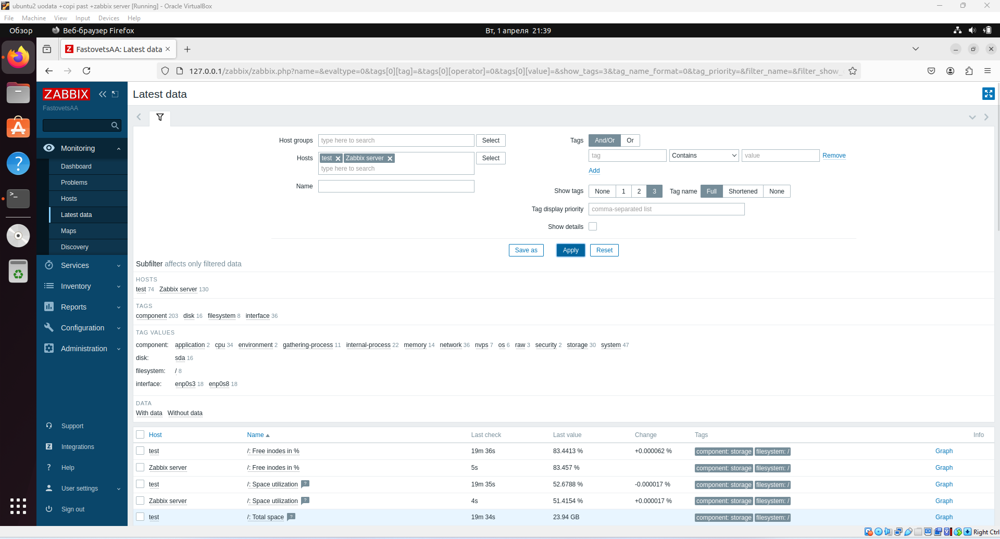

# Домашнее задание к занятию "Система мониторинга Zabbix" - Фастовца Александра

## Задание 1

-Установите Zabbix Server с веб-интерфейсом

-Приложите в файл README.md текст использованных команд в GitHub.

-git clone https://github.com/MorikMo/Morik3101-hw-02.md

-cd Morik3101-hw-02.md

-git status

-git add img/img101.png

-git add img/img102.png

-git commit -m "Добавлены скриншоты для задания 1"

-git commit -m "Обновлена документация в README.md"

-git push origin main

## Задание 2

Установите Zabbix Agent на два хоста.
1

2

3

Приложите в файл README.md текст использованных команд в GitHub.

-git status

-git add img/img101.png

-git add img/img102.png

-git add README.md

-git commit -m "Добавлены скриншоты для задания 2"

-git commit -m "Обновлена документация в README.md"

-git push origin main

# Домашнее задание к занятию "Система мониторинга Zabbix -2"

## Задание 1

Создайте свой шаблон, в котором будут элементы данных, мониторящие загрузку CPU и RAM хоста.

1

## Задание 2-3

Добавьте в Zabbix два хоста и задайте им имена <фамилия и инициалы-1> и <фамилия и инициалы-2>. Например: ivanovii-1 и ivanovii-2.

Привяжите созданный шаблон к двум хостам. Также привяжите к обоим хостам шаблон Linux by Zabbix Agent.

1

2

## Задание 4

Создайте свой кастомный дашборд.

1
